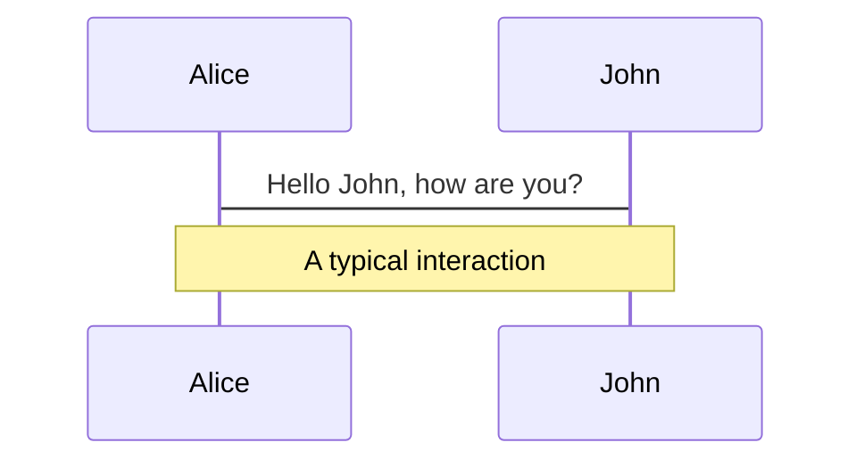
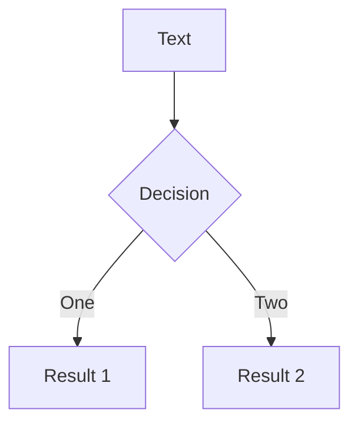
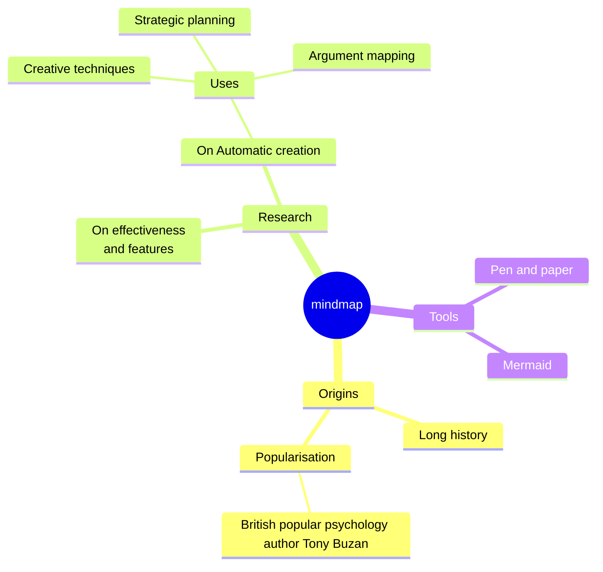
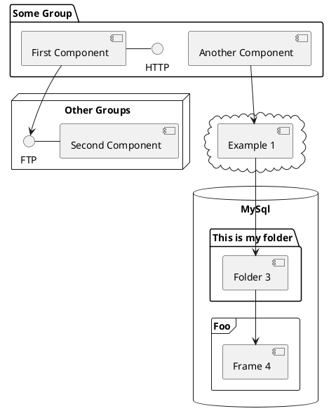

---
# You can also start simply with 'default'
theme: seriph
# random image from a curated Unsplash collection by Anthony
# like them? see https://unsplash.com/collections/94734566/slidev
background: https://unsplash.com/photos/mYBMP8pW4uQ/download?ixid=M3wxMjA3fDB8MXxjb2xsZWN0aW9ufDl8OTQ3MzQ1NjZ8fHx8fDJ8fDE3MjY4MDQwNDl8&force=true&w=2400
# some information about your slides (markdown enabled)
title: LLGo Rust Ecosystem Explore
info: |
  ## LLGo Rust Ecosystem Explore
# apply unocss classes to the current slide
class: text-center
# https://sli.dev/features/drawing
drawings:
  persist: false
# slide transition: https://sli.dev/guide/animations.html#slide-transitions
transition: slide-left
# enable MDC Syntax: https://sli.dev/features/mdc
mdc: true
---

# LLGo Rust Ecosystem Explore

Yisheng Chai & Yingjie Zhao

---
transition: fade-out
---

# Who are we?

- Yisheng Chai: Golang&Rust Backend Developer, I've built [Zeabur](https://zeabur.com) which is a cloud native deployment platform, [Casbin-rs](https://github.com/casbin/casbin-rs) rust implementation of [Casbin](https://casbin.org) which is an efficient open-source access control library in Go. I write golang for work and rust for fun. You can get in touch with me on [hackerchai.com](https://hackerchai.com)
<br>
<br>
- Yingjie Zhao: TO BE FILLED
<br>
<br>

<style>
h1 {
  background-color: #2B90B6;
  background-image: linear-gradient(45deg, #4EC5D4 10%, #146b8c 20%);
  background-size: 100%;
  -webkit-background-clip: text;
  -moz-background-clip: text;
  -webkit-text-fill-color: transparent;
  -moz-text-fill-color: transparent;
}
</style>

---
transition: fade-out
---

# Introduction LLGo

> LLGo is a Go compiler based on LLVM in order to better integrate Go with the C ecosystem including Python.<br>
LLGo aims to expand the boundaries of Go/Go+, providing limitless possibilities such as:

- 🕹️Game development
- 🤖AI and data science
- 💻WebAssembly
- 🦾Embedded development
<br>
<br>

LLGo can do more than Golang!

<style>
h1 {
  background-color: #2B90B6;
  background-image: linear-gradient(45deg, #4EC5D4 10%, #146b8c 20%);
  background-size: 100%;
  -webkit-background-clip: text;
  -moz-background-clip: text;
  -webkit-text-fill-color: transparent;
  -moz-text-fill-color: transparent;
}
</style>

---
transition: fade-out
---

# Introduction Rust

> Rust is a language empowering everyone to build reliable and efficient software, it can power performance-critical services, run on embedded devices, and easily integrate with other languages.

- 🌪 **Performance** - Rust is blazingly fast and memory-efficient: with no runtime or garbage collector
- 🏭 **Reliability** - Rust’s rich type system and ownership model guarantee memory-safety and thread-safety
- 🔧 **Productivity** - Rust has great documentation, a friendly compiler with useful error messages, and top-notch tooling
- 🧑‍💻 **FFI Friendly** - Rust also use LLVM as backend, so it can easily integrate with other languages
<br>
<br>

Meet more highlights with LLGo + Rust?

<style>
h1 {
  background-color: #2B90B6;
  background-image: linear-gradient(45deg, #4EC5D4 10%, #146b8c 20%);
  background-size: 100%;
  -webkit-background-clip: text;
  -moz-background-clip: text;
  -webkit-text-fill-color: transparent;
  -moz-text-fill-color: transparent;
}
</style>
---
layoutClass: gap-16
transition: slide-up
---

# Overview

<Toc v-click columns="2" minDepth="1" maxDepth="1"></Toc>


---
transition: slide-up
---

# Targets

At first, we have multiple thoughts on how to utilize Rust to enhance the LLGo ecosystem, including async runtime, async io,programming language infrastructure, etc. We need to make some trade-offs.

## TODO
<br>

- [ ] Binding Rust FFI to LLGo
- [ ] Port Rust Actor Mode [Actix](https://github.com/actix/actix)
- [ ] Utilize some Rust Crates as LLGo's standard library
- [ ] Port some famous and efficient Rust framework to LLGo
- [ ] Implement LLGo's net/http using Rust web infrastructure


---
layout: center
class: text-center
---

<style>
    .container {
        background-color: white;
        border-radius: 10px;
        padding: 20px;
        box-shadow: 0 0 10px rgba(0,0,0,0.1);
        width: 800px;
    }
    h1 {
        text-align: center;
        color: #333;
        margin-bottom: 20px;
    }
    .advantages {
        display: grid;
        grid-template-columns: 1fr 1fr;
        gap: 20px;
    }
    .advantage {
        background-color: #f9f9f9;
        border-radius: 8px;
        box-shadow: 0 2px 5px rgba(0,0,0,0.1);
        padding: 15px;
    }
    .advantage h2 {
        color: #e57373;
        margin-top: 0;
        font-size: 18px;
        display: flex;
        align-items: center;
    }
    .advantage p {
        color: #666;
        font-size: 14px;
        margin-bottom: 0;
    }
    .icon {
        font-size: 24px;
        margin-right: 10px;
    }
</style>

# Technical Pain Points

<br>

<div class="container">
    <div class="advantages">
        <div class="advantage">
            <h2><span class="icon">🚀</span>Performance and Safety</h2>
            <p>Near-C performance with memory safety, ideal for high-performance network libraries.</p>
        </div>
        <div class="advantage">
            <h2><span class="icon">🛡️</span>Concurrency Safety</h2>
            <p>Catches memory errors and data races at compile-time, reducing runtime errors and vulnerabilities.</p>
        </div>
        <div class="advantage">
            <h2><span class="icon">⚡</span>Asynchronous Programming</h2>
            <p>Strong async support facilitates efficient non-blocking I/O while maintaining code clarity.</p>
        </div>
        <div class="advantage">
            <h2><span class="icon">🔗</span>Compatibility</h2>
            <p>Excellent FFI support enables easy C library integration and seamless incorporation into LLGo.</p>
        </div>
    </div>
</div>


---
layout: image-right
image: https://cover.sli.dev
---

# Technical Implementations

Use code snippets and get the highlighting directly, and even types hover!

```ts {all|5|7|7-8|10|all} twoslash
// TwoSlash enables TypeScript hover information
// and errors in markdown code blocks
// More at https://shiki.style/packages/twoslash

import { computed, ref } from 'vue'

const count = ref(0)
const doubled = computed(() => count.value * 2)

doubled.value = 2
```

<arrow v-click="[4, 5]" x1="350" y1="310" x2="195" y2="334" color="#953" width="2" arrowSize="1" />

<!-- This allow you to embed external code blocks -->
<<< @/snippets/external.ts#snippet

<!-- Footer -->

[Learn more](https://sli.dev/features/line-highlighting)

<!-- Inline style -->
<style>
.footnotes-sep {
  @apply mt-5 opacity-10;
}
.footnotes {
  @apply text-sm opacity-75;
}
.footnote-backref {
  display: none;
}
</style>

<!--
Notes can also sync with clicks

[click] This will be highlighted after the first click

[click] Highlighted with `count = ref(0)`

[click:3] Last click (skip two clicks)
-->

---
level: 2
---

# How to port Rust FFI to LLGo

C compatible FFI interface in Rust

Here are the key points:

````md magic-move {lines: true}
```toml {*|7|*}
// 1: Configure Cargo.toml
// Add necessary dependencies and configure to generate a C-compatible dynamic library.
[dependencies]
libc = "0.2"

[lib]
crate-type = ["cdylib"]
```

```toml {*|3-4|*}
// 2: Configure Cargo.toml
// Wrap Rust functions with special attributes and unsafe blocks to make them callable from C.
#[no_mangle]
pub unsafe extern "C" fn add_numbers_c(a: i32, b: i32) -> i32 {
    add_numbers(a, b)
}
```

```rust {*|4|9|*}
// 3: Memory Management
// Use Box to manage dynamic memory, ensuring correct memory release between Rust and C.
#[no_mangle]
pub unsafe extern "C" fn sled_create_config() -> *mut Config {
    Box::into_raw(Box::new(Config::new()))
}

#[no_mangle]
pub unsafe extern "C" fn sled_free_config(config: *mut Config) {
    drop(Box::from_raw(config));
}
```

Non-code blocks are ignored.

```rust {*|4|5-6|*}
// 4: String Handling
// Convert strings between C and Rust.
#[no_mangle]
pub extern "C" fn csv_reader_read_record(ptr: *mut c_void) -> *const c_char {
    // ... 
    match CString::new(format!("{:?}\n", record)) {
        Ok(c_string) => c_string.into_raw(),
        Err(_) => ptr::null(),
    }
    // ...
}
```

```rust {*|3-4|5-6|*}
// 5: Map Rust functions in Go, ensuring type consistency.
// Convert strings between C and Rust.
//go:linkname NewReader C.csv_reader_new
func NewReader(file_path *c.Char) *Reader

// llgo:link (*Reader).Free C.csv_reader_free
func (reader *Reader) Free() {}
```

```rust {*|3|*}
// 6: Install Dynamic Library.
// Use the dylib-installer tool to install the generated dynamic library and header files.
sudo dylib_installer <dylib_lib> <header_file_lib>
```
````
---
level: 2
---

# Roadmap #2

Powered by [shiki-magic-move](https://shiki-magic-move.netlify.app/), Slidev supports animations across multiple code snippets.

Add multiple code blocks and wrap them with <code>````md magic-move</code> (four backticks) to enable the magic move. For example:

````md magic-move {lines: true}
```ts {*|2|*}
// step 1
const author = reactive({
  name: 'John Doe',
  books: [
    'Vue 2 - Advanced Guide',
    'Vue 3 - Basic Guide',
    'Vue 4 - The Mystery'
  ]
})
```

```ts {*|1-2|3-4|3-4,8}
// step 2
export default {
  data() {
    return {
      author: {
        name: 'John Doe',
        books: [
          'Vue 2 - Advanced Guide',
          'Vue 3 - Basic Guide',
          'Vue 4 - The Mystery'
        ]
      }
    }
  }
}
```

```ts
// step 3
export default {
  data: () => ({
    author: {
      name: 'John Doe',
      books: [
        'Vue 2 - Advanced Guide',
        'Vue 3 - Basic Guide',
        'Vue 4 - The Mystery'
      ]
    }
  })
}
```

Non-code blocks are ignored.

```vue
<!-- step 4 -->
<script setup>
const author = {
  name: 'John Doe',
  books: [
    'Vue 2 - Advanced Guide',
    'Vue 3 - Basic Guide',
    'Vue 4 - The Mystery'
  ]
}
</script>
```
````

---
level: 2
---

# Roadmap #3

Powered by [shiki-magic-move](https://shiki-magic-move.netlify.app/), Slidev supports animations across multiple code snippets.

Add multiple code blocks and wrap them with <code>````md magic-move</code> (four backticks) to enable the magic move. For example:

````md magic-move {lines: true}
```ts {*|2|*}
// step 1
const author = reactive({
  name: 'John Doe',
  books: [
    'Vue 2 - Advanced Guide',
    'Vue 3 - Basic Guide',
    'Vue 4 - The Mystery'
  ]
})
```

```ts {*|1-2|3-4|3-4,8}
// step 2
export default {
  data() {
    return {
      author: {
        name: 'John Doe',
        books: [
          'Vue 2 - Advanced Guide',
          'Vue 3 - Basic Guide',
          'Vue 4 - The Mystery'
        ]
      }
    }
  }
}
```

```ts
// step 3
export default {
  data: () => ({
    author: {
      name: 'John Doe',
      books: [
        'Vue 2 - Advanced Guide',
        'Vue 3 - Basic Guide',
        'Vue 4 - The Mystery'
      ]
    }
  })
}
```

Non-code blocks are ignored.

```vue
<!-- step 4 -->
<script setup>
const author = {
  name: 'John Doe',
  books: [
    'Vue 2 - Advanced Guide',
    'Vue 3 - Basic Guide',
    'Vue 4 - The Mystery'
  ]
}
</script>
```
````


---
level: 2
---

# Achievements #1

<div grid="~ cols-2 gap-4">
<div>

You can use Vue components directly inside your slides.

We have provided a few built-in components like `<Tweet/>` and `<Youtube/>` that you can use directly. And adding your custom components is also super easy.

```html
<Counter :count="10" />
```

<!-- ./components/Counter.vue -->
<Counter :count="10" m="t-4" />

Check out [the guides](https://sli.dev/builtin/components.html) for more.

</div>
<div>

```html
<Tweet id="1390115482657726468" />
```

<Tweet id="1390115482657726468" scale="0.65" />

</div>
</div>

<!--
Presenter note with **bold**, *italic*, and ~~striked~~ text.

Also, HTML elements are valid:
<div class="flex w-full">
  <span style="flex-grow: 1;">Left content</span>
  <span>Right content</span>
</div>
-->

---
level: 2
---

# Achievements #2

<div grid="~ cols-2 gap-4">
<div>

You can use Vue components directly inside your slides.

We have provided a few built-in components like `<Tweet/>` and `<Youtube/>` that you can use directly. And adding your custom components is also super easy.

```html
<Counter :count="10" />
```

<!-- ./components/Counter.vue -->
<Counter :count="10" m="t-4" />

Check out [the guides](https://sli.dev/builtin/components.html) for more.

</div>
<div>

```html
<Tweet id="1390115482657726468" />
```

<Tweet id="1390115482657726468" scale="0.65" />

</div>
</div>

<!--
Presenter note with **bold**, *italic*, and ~~striked~~ text.

Also, HTML elements are valid:
<div class="flex w-full">
  <span style="flex-grow: 1;">Left content</span>
  <span>Right content</span>
</div>
-->

---
level: 2
---

# Achievements #3

<div grid="~ cols-2 gap-4">
<div>

You can use Vue components directly inside your slides.

We have provided a few built-in components like `<Tweet/>` and `<Youtube/>` that you can use directly. And adding your custom components is also super easy.

```html
<Counter :count="10" />
```

<!-- ./components/Counter.vue -->
<Counter :count="10" m="t-4" />

Check out [the guides](https://sli.dev/builtin/components.html) for more.

</div>
<div>

```html
<Tweet id="1390115482657726468" />
```

<Tweet id="1390115482657726468" scale="0.65" />

</div>
</div>

<!--
Presenter note with **bold**, *italic*, and ~~striked~~ text.

Also, HTML elements are valid:
<div class="flex w-full">
  <span style="flex-grow: 1;">Left content</span>
  <span>Right content</span>
</div>
-->


---

# Benchmarks

You can add `v-click` to elements to add a click animation.

<div v-click>

This shows up when you click the slide:

```html
<div v-click>This shows up when you click the slide.</div>
```

</div>

<br>

<v-click>

The <span v-mark.red="3"><code>v-mark</code> directive</span>
also allows you to add
<span v-mark.circle.orange="4">inline marks</span>
, powered by [Rough Notation](https://roughnotation.com/):

```html
<span v-mark.underline.orange>inline markers</span>
```

</v-click>

<div mt-20 v-click>

[Learn more](https://sli.dev/guide/animations#click-animation)

</div>

---

# Conclusion

Motion animations are powered by [@vueuse/motion](https://motion.vueuse.org/), triggered by `v-motion` directive.

```html
<div
  v-motion
  :initial="{ x: -80 }"
  :enter="{ x: 0 }"
  :click-3="{ x: 80 }"
  :leave="{ x: 1000 }"
>
  Slidev
</div>
```

<div class="w-60 relative">
  <div class="relative w-40 h-40">
    
    
    
  </div>

  <div
    class="text-5xl absolute top-14 left-40 text-[#2B90B6] -z-1"
    v-motion
    :initial="{ x: -80, opacity: 0}"
    :enter="{ x: 0, opacity: 1, transition: { delay: 2000, duration: 1000 } }">
    Slidev
  </div>
</div>

<!-- vue script setup scripts can be directly used in markdown, and will only affects current page -->
<script setup lang="ts">
const final = {
  x: 0,
  y: 0,
  rotate: 0,
  scale: 1,
  transition: {
    type: 'spring',
    damping: 10,
    stiffness: 20,
    mass: 2
  }
}
</script>

<div
  v-motion
  :initial="{ x:35, y: 30, opacity: 0}"
  :enter="{ y: 0, opacity: 1, transition: { delay: 3500 } }">

[Learn more](https://sli.dev/guide/animations.html#motion)

</div>

---

# Problems

- The client functionality still has some issues. When the concurrency level is too high, there's a probability of causing program blockage.


---

# Future

You can create diagrams / graphs from textual descriptions, directly in your Markdown.

<div class="grid grid-cols-4 gap-5 pt-4 -mb-6">









</div>

Learn more: [Mermaid Diagrams](https://sli.dev/features/mermaid) and [PlantUML Diagrams](https://sli.dev/features/plantuml)

---
foo: bar
layout: center
class: text-center
---

<style>
    body {
        font-family: 'Arial', sans-serif;
        background: linear-gradient(135deg, #f5f7fa 0%, #c3cfe2 100%);
        height: 100vh;
        margin: 0;
        display: flex;
        justify-content: center;
        align-items: center;
    }
    .container {
        background-color: rgba(255, 255, 255, 0.9);
        border-radius: 15px;
        padding: 40px;
        box-shadow: 0 10px 30px rgba(0, 0, 0, 0.1);
        text-align: center;
    }
    h1 {
        color: #333;
        margin-bottom: 30px;
    }
    ul {
        list-style-type: none;
        padding: 0;
    }
    li {
        margin: 15px 0;
        font-size: 18px;
        color: #555;
    }
    .footer {
        margin-top: 30px;
        font-style: italic;
        color: #777;
    }
</style>

# Thanks

<div class="container">
    <ul>
        <li>@老许</li>
        <li>@各位导师</li>
        <li>@军哥</li>
        <li>@张之阳</li>
        <li>@HR</li>
    </ul>
    <p class="footer">Your support and guidance made this project possible.</p>
</div>

--- 
layout: center
class: text-center
---

<style>
  .container {
      background-color: rgba(255, 255, 255, 0.9);
      border-radius: 15px;
      padding: 40px;
      box-shadow: 0 10px 30px rgba(0, 0, 0, 0.1);
      text-align: center;
      max-width: 800px;
      width: 100%;
  }
  .links {
      display: flex;
      justify-content: center;
      flex-wrap: wrap;
      gap: 20px;
  }
  .link {
      flex: 0 1 calc(33.333% - 20px);
      min-width: 150px;
      padding: 12px 24px;
      background-color: #4facfe;
      color: white;
      text-decoration: none;
      border-radius: 25px;
      font-size: 18px;
      transition: all 0.3s ease;
      display: flex;
      justify-content: center;
      align-items: center;
      text-align: center;
  }
  .link:hover {
      background-color: #00f2fe;
      transform: translateY(-3px);
      box-shadow: 0 5px 15px rgba(0, 0, 0, 0.1);
  }
  @media (max-width: 600px) {
      .link {
          flex: 0 1 calc(50% - 20px);
      }
  }
  @media (max-width: 400px) {
      .link {
          flex: 0 1 100%;
      }
  }
</style>

# Links
<br>


<div class="container">
    <div class="links">
        <a href="https://github.com/goplus/llgo" class="link" target="_blank">LLGo GitHub</a>
        <a href="https://github.com/goplus/gop" class="link" target="_blank">Go+ GitGub</a>
        <a href="https://github.com/goplus/llgo/blob/main/doc/How-to-support-a-Rust-Library.md" class="link" target="_blank">Documentation</a>
        <a href="https://github.com/goplus/llgoexamples/tree/main/rust/hyper" class="link" target="_blank">hyper.go</a>
        <a href="https://github.com/goplus/llgoexamples/tree/main/rust/opendal" class="link" target="_blank">opendal.go</a>
        <a href="https://github.com/goplus/llgoexamples/tree/main/rust/sled" class="link" target="_blank">sled.go</a>
    </div>
</div>
<br>
<br>


---
layout: center
class: text-center
---

# Thank You For Listening

<style>
  .container {
      background-color: rgba(255, 255, 255, 0.9);
      border-radius: 15px;
      padding: 40px;
      box-shadow: 0 10px 30px rgba(0, 0, 0, 0.1);
      text-align: center;
  }
  .person {
      margin-bottom: 30px; /* Increased margin for better separation */
  }
  .name {
      font-size: 24px;
      color: #333;
      margin-bottom: 10px; /* Increased margin */
      line-height: 1.3; /* Specific line height for names */
  }
  .email {
      color: #666;
      font-size: 18px;
      line-height: 1.4; /* Specific line height for email */
      display: inline-block; /* Added to ensure proper line height */
  }
  .email:hover {
      color: #4a4a4a;
  }
</style>

<div class="container">
    <div class="person">
        <div class="name">Yisheng Chai</div>
        <a href="mailto:i@hackerchai.com" class="email">i@hackerchai.com</a>
    </div>
    <div class="person">
        <div class="name">Yingjie Zhao</div>
        <a href="mailto:spongehah@163.com" class="email">spongehah@163.com</a>
    </div>
</div>
