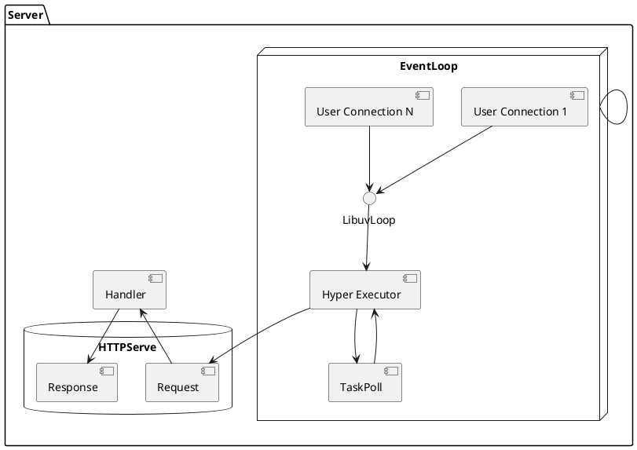

---
# You can also start simply with 'default'
theme: seriph
# random image from a curated Unsplash collection by Anthony
# like them? see https://unsplash.com/collections/94734566/slidev
background: https://unsplash.com/photos/mYBMP8pW4uQ/download?ixid=M3wxMjA3fDB8MXxjb2xsZWN0aW9ufDl8OTQ3MzQ1NjZ8fHx8fDJ8fDE3MjY4MDQwNDl8&force=true&w=2400
# some information about your slides (markdown enabled)
title: LLGo Rust Ecosystem Explore
info: |
  ## LLGo Rust Ecosystem Explore
# apply unocss classes to the current slide
class: text-center
# https://sli.dev/features/drawing
drawings:
  persist: false
# slide transition: https://sli.dev/guide/animations.html#slide-transitions
transition: slide-left
# enable MDC Syntax: https://sli.dev/features/mdc
mdc: true
---

# LLGo Rust Ecosystem Explore

Yisheng Chai & Yingjie Zhao

---
transition: fade-out
---

# Who are we?

- Yisheng Chai: Golang&Rust Backend Developer, I've built [Zeabur](https://zeabur.com) which is a cloud native deployment platform, [Casbin-rs](https://github.com/casbin/casbin-rs) rust implementation of [Casbin](https://casbin.org) which is an efficient open-source access control library in Go. I write golang for work and rust for fun. You can get in touch with me on [hackerchai.com](https://hackerchai.com)
<br>
<br>
- Yingjie Zhao: Golang&Java Backend Developer, At Qiniu, I encountered Go for the first time, and I look forward to improving and doing better.
<br>
<br>

<style>
h1 {
  background-color: #2B90B6;
  background-image: linear-gradient(45deg, #4EC5D4 10%, #146b8c 20%);
  background-size: 100%;
  -webkit-background-clip: text;
  -moz-background-clip: text;
  -webkit-text-fill-color: transparent;
  -moz-text-fill-color: transparent;
}
</style>

---
transition: fade-out
---

# Introduction LLGo

> LLGo is a Go compiler based on LLVM in order to better integrate Go with the C ecosystem including Python.<br>
LLGo aims to expand the boundaries of Go/Go+, providing limitless possibilities such as:

- 🕹️Game development
- 🤖AI and data science
- 💻WebAssembly
- 🦾Embedded development
<br>
<br>

LLGo can do more than Golang!

<style>
h1 {
  background-color: #2B90B6;
  background-image: linear-gradient(45deg, #4EC5D4 10%, #146b8c 20%);
  background-size: 100%;
  -webkit-background-clip: text;
  -moz-background-clip: text;
  -webkit-text-fill-color: transparent;
  -moz-text-fill-color: transparent;
}
</style>

---
transition: fade-out
---

# Introduction Rust

> Rust is a language empowering everyone to build reliable and efficient software, it can power performance-critical services, run on embedded devices, and easily integrate with other languages.

- 🌪 **Performance** - Rust is blazingly fast and memory-efficient: with no runtime or garbage collector
- 🏭 **Reliability** - Rust’s rich type system and ownership model guarantee memory-safety and thread-safety
- 🔧 **Productivity** - Rust has great documentation, a friendly compiler with useful error messages, and top-notch tooling
- 🧑‍💻 **FFI Friendly** - Rust also use LLVM as backend, so it can easily integrate with other languages
<br>
<br>

Meet more highlights with LLGo + Rust?

<style>
h1 {
  background-color: #2B90B6;
  background-image: linear-gradient(45deg, #4EC5D4 10%, #146b8c 20%);
  background-size: 100%;
  -webkit-background-clip: text;
  -moz-background-clip: text;
  -webkit-text-fill-color: transparent;
  -moz-text-fill-color: transparent;
}
</style>
---
layoutClass: gap-16
transition: slide-up
---

# Overview

<Toc v-click columns="2" minDepth="1" maxDepth="1"></Toc>


---
transition: slide-up
---

# Targets

At first, we have multiple thoughts on how to utilize Rust to enhance the LLGo ecosystem, including async runtime, async io,programming language infrastructure, etc. We need to make some trade-offs.

## TODO
<br>

- [ ] Binding Rust FFI to LLGo
- [ ] Port Rust Actor Mode [Actix](https://github.com/actix/actix)
- [ ] Utilize some Rust Crates as LLGo's standard library
- [ ] Port some famous and efficient Rust framework to LLGo
- [ ] Implement LLGo's net/http using Rust web infrastructure


---
layout: center
class: text-center
---

<style>
    .container {
        background-color: white;
        border-radius: 10px;
        padding: 20px;
        box-shadow: 0 0 10px rgba(0,0,0,0.1);
        width: 800px;
    }
    .advantages {
        display: grid;
        grid-template-columns: 1fr 1fr;
        gap: 20px;
    }
    .advantage {
        background-color: #f9f9f9;
        border-radius: 8px;
        box-shadow: 0 2px 5px rgba(0,0,0,0.1);
        padding: 15px;
    }
    .advantage h2 {
        color: #e57373;
        margin-top: 0;
        font-size: 18px;
        display: flex;
        align-items: center;
    }
    .advantage p {
        color: #666;
        font-size: 14px;
        margin-bottom: 0;
    }
    .icon {
        font-size: 24px;
        margin-right: 10px;
    }
</style>

# Technical Pain Points

<br>

<div class="container">
    <div class="advantages">
        <div class="advantage">
            <h2><span class="icon">🚀</span>Performance and Safety</h2>
            <p>Near-C performance with memory safety, ideal for high-performance network libraries.</p>
        </div>
        <div class="advantage">
            <h2><span class="icon">🛡️</span>Concurrency Safety</h2>
            <p>Catches memory errors and data races at compile-time, reducing runtime errors and vulnerabilities.</p>
        </div>
        <div class="advantage">
            <h2><span class="icon">⚡</span>Asynchronous Programming</h2>
            <p>Strong async support facilitates efficient non-blocking I/O while maintaining code clarity.</p>
        </div>
        <div class="advantage">
            <h2><span class="icon">🔗</span>Compatibility</h2>
            <p>Excellent FFI support enables easy C library integration and seamless incorporation into LLGo.</p>
        </div>
    </div>
</div>

---
layout: two-cols
---

# Technical Implementations

Our goal is to implement a simple HTTP server/client using Rust Hyper and Libuv as async runtime.

````md magic-move {lines: true}
```go {*|2-5|8-14|*}
// get the number of processors on the system
cpuCount = int(c.Sysconf(_SC_NPROCESSORS_ONLN))
if cpuCount <= 0 {
  cpuCount = 4
}

// create event loops
for i := 0; i < cpuCount; i++ {
  el, err := newEventLoop()
  if err != nil {
    return fmt.Errorf("failed to create event loop")
  }
  srv.eventLoop = append(srv.eventLoop, el)
}
```
````

<!-- Inline style -->
<style>
.footnotes-sep {
  @apply mt-5 opacity-10;
}
.footnotes {
  @apply text-sm opacity-75;
}
.footnote-backref {
  display: none;
}
</style>
::right::


---
level: 2
---

# How to port Rust FFI to LLGo

C compatible FFI interface in Rust

Here are the key points:

````md magic-move {lines: true}
```toml {*|7|*}
// 1: Configure Cargo.toml
// Add necessary dependencies and configure to generate a C-compatible dynamic library.
[dependencies]
libc = "0.2"

[lib]
crate-type = ["cdylib"]
```

```rust {*|3-4|*}
// 2: Configure Cargo.toml
// Wrap Rust functions with special attributes and unsafe blocks to make them callable from C.
#[no_mangle]
pub unsafe extern "C" fn add_numbers_c(a: i32, b: i32) -> i32 {
    add_numbers(a, b)
}
```

```rust {*|4|9|*}
// 3: Memory Management
// Use Box to manage dynamic memory, ensuring correct memory release between Rust and C.
#[no_mangle]
pub unsafe extern "C" fn sled_create_config() -> *mut Config {
    Box::into_raw(Box::new(Config::new()))
}

#[no_mangle]
pub unsafe extern "C" fn sled_free_config(config: *mut Config) {
    drop(Box::from_raw(config));
}
```

Non-code blocks are ignored.

```rust {*|4|5-6|*}
// 4: String Handling
// Convert strings between C and Rust.
#[no_mangle]
pub extern "C" fn csv_reader_read_record(ptr: *mut c_void) -> *const c_char {
    // ... 
    match CString::new(format!("{:?}\n", record)) {
        Ok(c_string) => c_string.into_raw(),
        Err(_) => ptr::null(),
    }
    // ...
}
```

```go {*|3-4|5-6|*}
// 5: Map Rust functions in Go, ensuring type consistency.
// Map Rust functions in Go, ensuring type consistency.
//go:linkname NewReader C.csv_reader_new
func NewReader(file_path *c.Char) *Reader

// llgo:link (*Reader).Free C.csv_reader_free
func (reader *Reader) Free() {}
```

```shell {*|3|*}
// 6: Install Dynamic Library.
// Use the dylib-installer tool to install the generated dynamic library and header files.
sudo dylib_installer <dylib_lib> <header_file_lib>
```
````

---
level: 2
---

# How to port Rust FFI to LLGo

We also implement a side-project [dylib-installer](https://github.com/hackerchai/dylib-installer) tool to install the generated dynamic library and header files.
<br>
<br>


---
level: 2
---

<style>
    .container {
        background-color: white;
        border-radius: 10px;
        padding: 40px;
        box-shadow: 0 4px 6px rgba(0,0,0,0.1);
        width: 800px;
    }
    .features {
        display: flex;
        flex-wrap: wrap;
        justify-content: space-around;
    }
    .feature {
        width: 30%;
        margin-bottom: 30px;
        text-align: center;
    }
    .icon {
        font-size: 36px;
        margin-bottom: 10px;
        color: #4a90e2;
    }
    .feature h2 {
        color: #333;
        margin: 10px 0;
        font-size: 18px;
    }
    .feature p {
        color: #666;
        font-size: 14px;
        line-height: 1.4;
    }
    #event-loop {
        width: 100%;
        margin-bottom: 40px;
    }
    #event-loop .icon {
        font-size: 48px;
    }
    #event-loop h2 {
        font-size: 22px;
    }
</style>

# Successfully migrated libuv

[Libuv](https://github.com/libuv/libuv): A cross-platform asynchronous I/O library.

<center>
  <div class="container">
      <div class="features">
          <div id="event-loop" class="feature">
              <div class="icon">🔄</div>
              <h2>Event Loop</h2>
              <p>Efficiently handles asynchronous operations, forming the core of libuv's design</p>
          </div>
          <div class="feature">
              <div class="icon">📁</div>
              <h2>File System Operations</h2>
              <p>Asynchronous file I/O for efficient data handling</p>
          </div>
          <div class="feature">
              <div class="icon">🌐</div>
              <h2>Network Programming</h2>
              <p>TCP/UDP sockets, DNS resolution, and more</p>
          </div>
          <div class="feature">
              <div class="icon">🧵</div>
              <h2>Thread Pool</h2>
              <p>Handles blocking operations without affecting performance</p>
          </div>
          <div class="feature">
              <div class="icon">💻</div>
              <h2>Cross-platform Support</h2>
              <p>Works seamlessly on Windows, Linux, macOS, and more</p>
          </div>
      </div>
  </div>
</center>

---
level: 3
---

## Using Libuv in C and LLGo：
<br>
<br>

````md magic-move {lines: true}
```c {*|2|4-5|7-8|10-15|16|*}
// C
loop = uv_default_loop();

uv_tcp_t server;
uv_tcp_init(loop, &server);

struct sockaddr_in addr;
uv_ip4_addr("0.0.0.0", DEFAULT_PORT, &addr);

uv_tcp_bind(&server, (const struct sockaddr*)&addr, 0);
int r = uv_listen((uv_stream_t*) &server, DEFAULT_BACKLOG, on_new_connection);
if (r) {
    fprintf(stderr, "Listen error %s\n", uv_strerror(r));
    return 1;
}
uv_run(loop, UV_RUN_DEFAULT);
```

```go {*|2|4-5|7-8|10-15|16|*}
// LLGo
loop := libuv.DefaultLoop()

var server libuv.Tcp
libuv.InitTcp(loop, &server)

var addr cnet.SockaddrIn
libuv.Ip4Addr(c.Str("0.0.0.0"), DEFAULT_PORT, &addr)

server.Bind((*cnet.Sockaddr)(unsafe.Pointer(&addr)), 0)
r := (*libuv.Stream)(unsafe.Pointer(&server)).Listen(DEFAULT_BACKLOG, onNewConnection)
if r != 0 {
  fmt.Fprintf(os.Stderr, "Listen error %s\n", c.GoString(libuv.Strerror(libuv.Errno(r))))
  return 1
}
loop.Run(libuv.RUN_DEFAULT)
```
````

---
level: 2
---

# Implement LLGo's net/http using Rust Hyper

Why Hyper? [Hyper](https://hyper.rs/) is a fast, async HTTP client library low-level written in Rust. Also it's the basic library used by [Tokio](https://tokio.rs/) ecosystem to build async web server such as the well-known web framework [Axum](https://github.com/tokio-rs/axum).

Hyper provides native C FFI support for client and we implement server backing [PR #3084](https://github.com/hyperium/hyper/pull/3084):

````md magic-move {lines: true}
```shell {*|2|*}
// step 1: build the hyper dynamic library
RUSTFLAGS="--cfg hyper_unstable_ffi" cargo rustc --features client,server,http1,http2,ffi --crate-type cdylib
```
```c {*|3-6|*}
// step 2: implement the hyper FFI in C
static hyper_io *create_io(conn_data *conn) {
    hyper_io *io = hyper_io_new();
    hyper_io_set_userdata(io, (void *)conn, free_conn_data);
    hyper_io_set_read(io, read_cb);
    hyper_io_set_write(io, write_cb);

    return io;
}
```

```go {*|3-6}
// step 3: we can find the hyper FFI implementation in the following repo
https://github.com/hackerchai/hyper/tree/feature/server-ffi-libuv-demo/capi/examples
```
````
---
level: 2
---

# Implement LLGo's net/http using Rust Hyper

The core logic of hyper is `Executor` and `Task`

Here we implement the `net/http` logic using hyper task loop poll and libuv as async runtime:

````md magic-move {lines: true}
```go {*|2-4|3}
// step 1: link the hyper dynamic library
const (
	LLGoPackage = "link: $(pkg-config --libs hyper); -lhyper"
)
```

```go {*|3-6}
// step 2: implement the hyper FFI in LLGo
// Creates a task to execute the callback with each body chunk received.
// llgo:link (*Body).Foreach C.hyper_body_foreach
func (body *Body) Foreach(callback BodyForeachCallback, userdata c.Pointer, drop UserdataDrop) *Task {
	return nil
}
```

```go {*|4-6}
// step 3: using libuv as async runtime for hyper
func onNewConnection(serverStream *libuv.Stream, status c.Int) {
  ...
	if serverStream.Accept((*libuv.Stream)(unsafe.Pointer(&conn.Stream))) == 0 {
    ...
  }
}
```

```go {*|2-4|6-10}
// step 4: implement the net/http core logic in Golang
type Handler interface {
	ServeHTTP(ResponseWriter, *Request)
}

type ResponseWriter interface {
	Header() Header
	Write([]byte) (int, error)
	WriteHeader(statusCode int)
}
```
````


---
level: 2
---

# Async runtime option

<div grid="~ cols-2 gap-4">
<div>

`Libuv` gives us a non-blocking I/O model, which is suitable for building high-performance web servers and async I/O operations.

We can utilize `*libuv.Async` to implement LLGo's async syntactic sugar in the future.


```go
result := asyncTask.Await()
```

</div>
<div>

```html
<Tweet id="1390115482657726468" />
```

<Tweet id="1390115482657726468" scale="0.65" />

</div>
</div>

<!--
Presenter note with **bold**, *italic*, and ~~striked~~ text.

Also, HTML elements are valid:
<div class="flex w-full">
  <span style="flex-grow: 1;">Left content</span>
  <span>Right content</span>
</div>
-->


---
level: 2
---

# Ability for net/http Client

Using Hyper FFI with libuv, we have implemented basic client functionality, bringing the ability to send HTTP requests to LLGo.

<div grid="~ cols-2 gap-4">

```go
import (
	"fmt"
	"io"

	"github.com/goplus/llgoexamples/x/net/http"
)
func main() {
	resp, err := http.Get("https://httpbin.org")
	if err != nil {
		fmt.Println(err)
		return
	}
	defer resp.Body.Close()
	body, err := io.ReadAll(resp.Body)
	if err != nil {
		fmt.Println(err)
		return
	}
	fmt.Println(string(body))
}
```

<!--  -->

</div>

<!--
Presenter note with **bold**, *italic*, and ~~striked~~ text.

Also, HTML elements are valid:
<div class="flex w-full">
  <span style="flex-grow: 1;">Left content</span>
  <span>Right content</span>
</div>
-->

---
level: 2
---

# Ability for net/http Server

<div grid="~ cols-2 gap-4">
<div>

```go
func echoHandler(w http.ResponseWriter, r *http.Request) {
	fmt.Printf(">> %s %s HTTP/%d.%d\n", r.Method, r.RequestURI, r.ProtoMajor, r.ProtoMinor)
	for key, values := range r.Header {
		for _, value := range values {
			fmt.Printf(">> %s: %s\n", key, value)
		}
	}
	fmt.Printf(">> URL: %s\n", r.URL.String())
	fmt.Printf(">> RemoteAddr: %s\n", r.RemoteAddr)

	w.Header().Set("Content-Type", "text/plain")
	w.Write([]byte("Hello, World!"))
}

func main() {
	http.HandleFunc("/echo", echoHandler)

	fmt.Println("Starting server on :1234")
	server := http.NewServer("127.0.0.1:1234")
	if err := server.ListenAndServe(); err != nil {
		panic(err)
	}
}
```
</div>
<div>


</div>
</div>

<!--
Presenter note with **bold**, *italic*, and ~~striked~~ text.

Also, HTML elements are valid:
<div class="flex w-full">
  <span style="flex-grow: 1;">Left content</span>
  <span>Right content</span>
</div>
-->

---

# Benchmarks

Benchmark with 6 threads and 100/1000 connections:

| Language | qps-100c | qps-1000c | diff |
|----------|----------|----------|----------|
| LLGo |  42257.73 | 37401.09 | 0.00% |
| Golang |  97282.51 | 95185.08 | +154.50% |

<br>

| Language | qps-100c | qps-1000c | diff |
|----------|----------|----------|----------|
| LLGo |  42257.73 | 40612.14 | 0.00% |
| C |  67660.83 |  70277.74 | +66.6% |

This benchmark shows that Golang net/http is about <span v-mark.circle.orange="4">154% faster </span> than LLGo net/http, and C implementation is about <span v-mark.circle.orange="4">66.6% faster </span> than LLGo in same condition.

---
level: 2
---

# Growth & Challenges

Insights from Yingjie Zhao

Growth:

- **Technical Transition and Challenge**
From Java to Go, tackling low-level programming, enhancing comprehensive skills
- **Deep Dive into Programming Mindset**
Source code vs. business code, focusing on robustness, mastering Go features and patterns

Challenges:

- **The cost of language learning**
Uncertainty in transitioning from Rust to LLGo
- **The difficulties of mastering system fundamentals**
Using lower-level APIs for more fine-grained control, need for deep understanding of Hyper and Libuv to utilize them effectively

---
level: 2
---

# Growth & Challenges

Insights from Yisheng Chai

Growth:

- **Solid understanding of the fundamentals of the Go language**
When dealing with the underlying layers, a solid knowledge base is even more essential.
- **A more constructive architectural design capability.**
When designing large software, it's important to consider metrics like system scalability and robustness.

Challenges:

- **The difficulty and techniques of debugging** Debugging requires advanced skills and deep understanding. The absence of debugging tools demands even more caution.


---

# Problems

- The client functionality still has some issues. When the concurrency level is too high, there's a probability of causing program blockage.
- The server is not as fast as the Go net/http in the same conditions. It still has a long way to optimize.
- Due to lack of lightweight goroutine, the server handler can not operate stuck logic.
- [Hyper](https://github.com/hyperium/hyper) server FFI is not merged yet. It still have some issues.


---

# Future

We can do more:

- **Implement new async feature replace of thread based goroutine**
- **Takeover the Hyper [PR](https://github.com/hyperium/hyper/pull/3084) to make server feture stable**
- **Explore new async I/O model like io_uring**
- **Port more powerful rust ecosystem tools to LLGO**

---
foo: bar
layout: center
class: text-center
---

<style>
    body {
        font-family: 'Arial', sans-serif;
        background: linear-gradient(135deg, #f5f7fa 0%, #c3cfe2 100%);
        height: 100vh;
        margin: 0;
        display: flex;
        justify-content: center;
        align-items: center;
    }
    .container {
        background-color: rgba(255, 255, 255, 0.9);
        border-radius: 15px;
        padding: 40px;
        box-shadow: 0 10px 30px rgba(0, 0, 0, 0.1);
        text-align: center;
    }
    h1 {
        color: #333;
        margin-bottom: 30px;
    }
    ul {
        list-style-type: none;
        padding: 0;
    }
    li {
        margin: 15px 0;
        font-size: 18px;
        color: #555;
    }
    .footer {
        margin-top: 30px;
        font-style: italic;
        color: #777;
    }
</style>

# Thanks

<div class="container">
    <ul>
        <li>@老许</li>
        <li>@各位导师</li>
        <li>@军哥</li>
        <li>@张之阳</li>
        <li>@HR</li>
    </ul>
    <p class="footer">Your support and guidance made this project possible.</p>
</div>

--- 
layout: center
class: text-center
---

<style>
  .container {
      background-color: rgba(255, 255, 255, 0.9);
      border-radius: 15px;
      padding: 40px;
      box-shadow: 0 10px 30px rgba(0, 0, 0, 0.1);
      text-align: center;
      max-width: 800px;
      width: 100%;
  }
  .links {
      display: flex;
      justify-content: center;
      flex-wrap: wrap;
      gap: 20px;
  }
  .link {
      flex: 0 1 calc(33.333% - 20px);
      min-width: 150px;
      padding: 12px 24px;
      background-color: #4facfe;
      color: white;
      text-decoration: none;
      border-radius: 25px;
      font-size: 18px;
      transition: all 0.3s ease;
      display: flex;
      justify-content: center;
      align-items: center;
      text-align: center;
  }
  .link:hover {
      background-color: #00f2fe;
      transform: translateY(-3px);
      box-shadow: 0 5px 15px rgba(0, 0, 0, 0.1);
  }
  @media (max-width: 600px) {
      .link {
          flex: 0 1 calc(50% - 20px);
      }
  }
  @media (max-width: 400px) {
      .link {
          flex: 0 1 100%;
      }
  }
</style>

# Links
<br>


<div class="container">
    <div class="links">
        <a href="https://github.com/goplus/llgo" class="link" target="_blank">LLGo GitHub</a>
        <a href="https://github.com/goplus/gop" class="link" target="_blank">Go+ GitGub</a>
        <a href="https://github.com/goplus/llgo/blob/main/doc/How-to-support-a-Rust-Library.md" class="link" target="_blank">Documentation</a>
        <a href="https://github.com/goplus/llgoexamples/tree/main/rust/hyper" class="link" target="_blank">hyper.go</a>
        <a href="https://github.com/goplus/llgoexamples/tree/main/rust/opendal" class="link" target="_blank">opendal.go</a>
        <a href="https://github.com/goplus/llgoexamples/tree/main/rust/sled" class="link" target="_blank">sled.go</a>
    </div>
</div>
<br>
<br>


---
layout: center
class: text-center
---

# Thank You For Listening

<style>
  .container {
      background-color: rgba(255, 255, 255, 0.9);
      border-radius: 15px;
      padding: 40px;
      box-shadow: 0 10px 30px rgba(0, 0, 0, 0.1);
      text-align: center;
  }
  .person {
      margin-bottom: 30px; /* Increased margin for better separation */
  }
  .name {
      font-size: 24px;
      color: #333;
      margin-bottom: 10px; /* Increased margin */
      line-height: 1.3; /* Specific line height for names */
  }
  .email {
      color: #666;
      font-size: 18px;
      line-height: 1.4; /* Specific line height for email */
      display: inline-block; /* Added to ensure proper line height */
  }
  .email:hover {
      color: #4a4a4a;
  }
</style>

<div class="container">
    <div class="person">
        <div class="name">Yisheng Chai</div>
        <a href="mailto:i@hackerchai.com" class="email">i@hackerchai.com</a>
    </div>
    <div class="person">
        <div class="name">Yingjie Zhao</div>
        <a href="mailto:spongehah@163.com" class="email">spongehah@163.com</a>
    </div>
</div>
